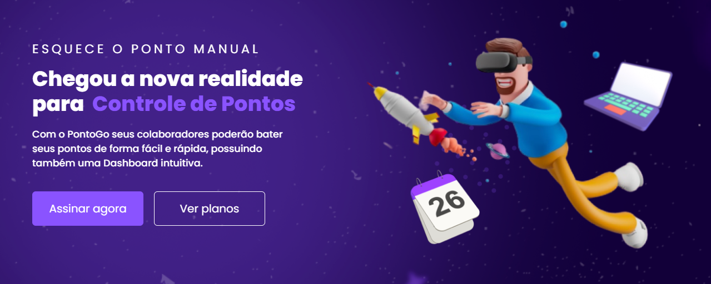
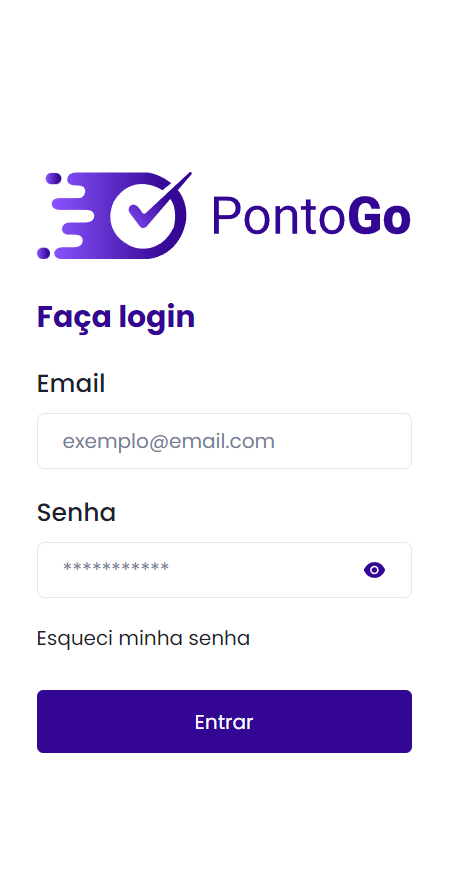
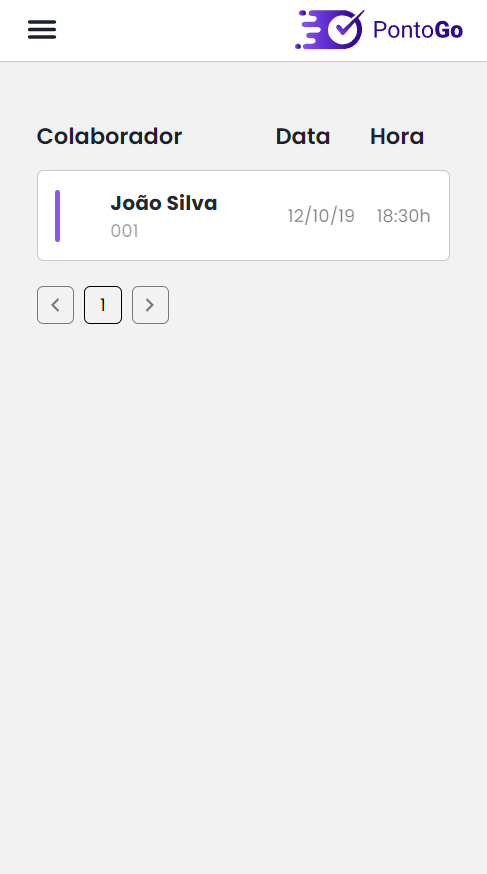
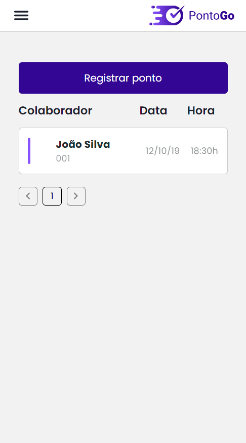
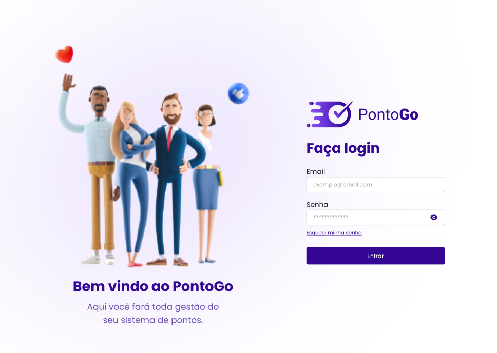
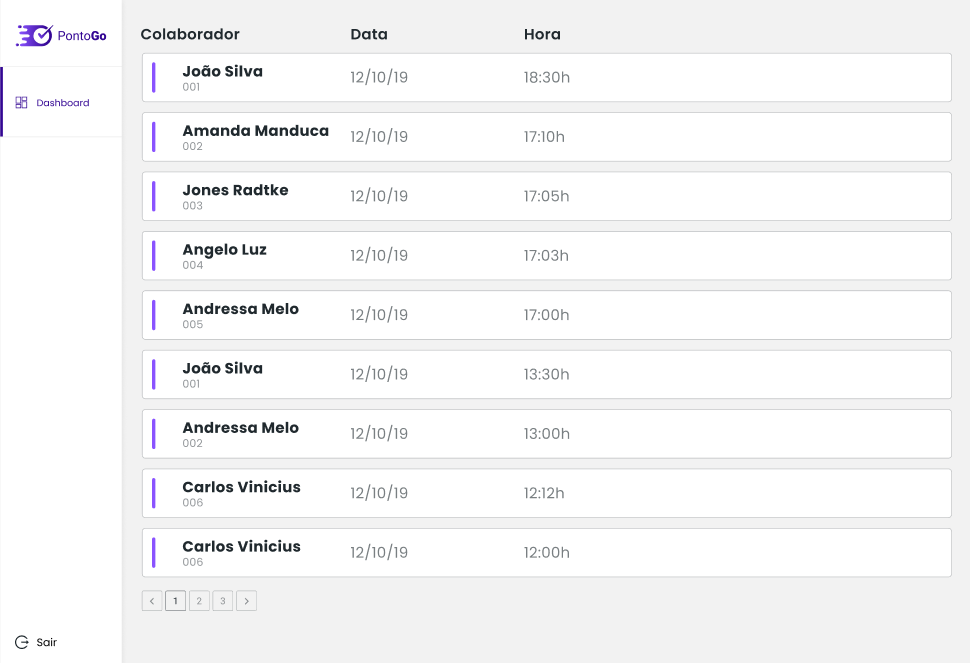
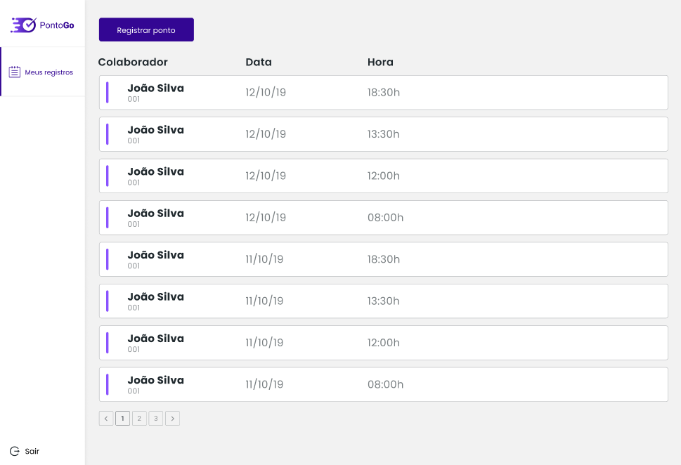

<h1 align="center">
    
</h1>

<h4 align="center"> 
	🚧  PontoGo  🚧
</h4>

<p align="center">
 <a href="#-sobre-o-projeto">Sobre</a> •
 <a href="#-funcionalidades">Funcionalidades</a> •
 <a href="#-layout">Layout</a> • 
 <a href="#-como-executar-o-projeto">Como executar</a> • 
 <a href="#-tecnologias">Tecnologias</a> •  
 <a href="#-autor">Autor</a> • 
 <a href="#user-content--licença">Licença</a>
</p>

## 💻 Sobre o projeto

O projeto Ponto Go se trata de um Sistema de Registro de Entradas

A aplicação se trata de um sistema para o gerenciamento de Registros de Ponto dos colaboradores de uma empresa.

Projeto desenvolvido durante um teste técnico de um processo seletivo oferecido pela empresa [Brainny.cc](https://brainny.cc/).

---

## ⚙️ Funcionalidades

- [x] Empresas podem controlar o registro de ponto de seus funcionários:
  - [x] Painel administrativo para visualização de todos os registros de ponto de seus funcionários
  - [x] Painel para o funcionário visualizar e registrar o seu ponto
- [x] Visualização responsiva para acesso mobile

---

## 🎨 Layout

O layout da aplicação está disponível no Figma:

<a href="https://www.figma.com/file/YiK4fI7Iuc1IUUZMZ3bbog/Teste_Frontend_J%C3%BAnior_Brainny_Register?type=design&node-id=15-202&mode=design&t=Yi2hVIzUHdMnPEUs-0">
  
</a>

### Mobile

<p align="center">
  

  

  
</p>

### Web

<p align="center" style="display: flex; align-items: flex-start; justify-content: center;">
 

  

  
</p>

---

## 🚀 Como executar o projeto Front End

💡A aplicação Frontend consome uma API GraphQL.

#### 🧭 Rodando a aplicação web (Frontend)

```bash

# Clone este repositório
$ git clone git@github.com:fespschulte/ponto-go.git

# Acesse a pasta da aplicação Front End
$ cd ponto-go

# Instale as dependências
$ npm install

# Execute a aplicação em modo de desenvolvimento
$ npm run dev


```

---

## 🛠 Tecnologias

As seguintes ferramentas foram usadas na construção do projeto:

#### **Website** [ViteJS](https://vitejs.dev/)

- **[React Router DOM v6](https://reactrouter.com/en/main)**
- **[chakra-ui] (https://chakra-ui.com/getting-started)**
- **[Apollo Client](https://www.apollographql.com/docs/react/)**
- **[Apollo Client React Hooks] (https://www.apollographql.com/docs/react/api/react/hooks)**
- **[GraphQL](https://graphql.org/learn/)**
- **[JWT Decode](https://www.npmjs.com/package/jwt-decode)**
- **[gitmoji] (https://gitmoji.dev/)**

> Veja o arquivo [package.json](https://github.com/fespschulte/ponto-go/blob/master/package.json)

---

## 🦸 Autor

Fernando Pinto

---
